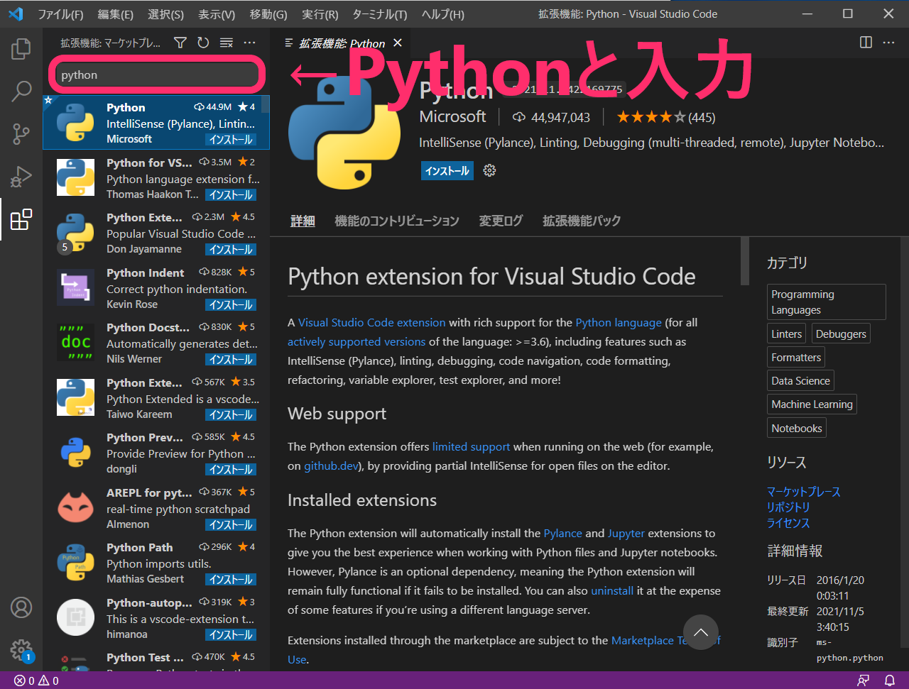

# VS Code の Python 開発に便利な拡張機能を追加

VS Code のインストールが出来たら次は Python 開発に便利な拡張機能の紹介とその追加方法を解説します。

## Python 開発に便利な拡張機能「Python」

Python 開発に便利な拡張機能は様々なものが存在しますが、最低限「Python」という名前の拡張機能を追加すると良いでしょう。

- [Python - Visual Studio Marketplace](https://marketplace.visualstudio.com/items?itemName=ms-python.python)

この拡張機能を追加することによって、VS Code で Python のコードを書く際により多くの支援が受けられるようになります。
いくつか例を挙げると次のものがあります。

- より強力なコード補完
- 主要なフレームワーク向けのデバッグ設定の利用
- コードチェックツールの実行
- テストコード実行
- デバッグ
- VS Code 内での Jupyter Notebook の実行

また、拡張機能「Python」を追加すると「[Jupyter](https://marketplace.visualstudio.com/items?itemName=ms-toolsai.jupyter)」「[Jupyter Keymap](https://marketplace.visualstudio.com/items?itemName=ms-toolsai.jupyter-keymap)」「[Jupyter Notebook Renderers](https://marketplace.visualstudio.com/items?itemName=ms-toolsai.jupyter-renderers)」「[Pylance](https://marketplace.visualstudio.com/items?itemName=ms-python.vscode-pylance)」という拡張機能も同時に追加されます。これらも「Python」同様に Python のコードを書く際に強力な支援が受けられるようになるものです。

### 参考1: 拡張機能「[Jupyter](https://marketplace.visualstudio.com/items?itemName=ms-toolsai.jupyter)」「[Jupyter Keymap](https://marketplace.visualstudio.com/items?itemName=ms-toolsai.jupyter-keymap)」「[Jupyter Notebook Renderers](https://marketplace.visualstudio.com/items?itemName=ms-toolsai.jupyter-renderers)」

拡張機能「Jupyter」はVS Code内でJuypyter Notebookの実行を可能にするプラグインです。「Juypyter Keymap」はWebブラウザ上のJupyter Notebookに準拠したキーマップを提供するために用いられます。「Jupyter Notebook Renderers」はグラフィカルな表現を描画する際に利用されます。

Jupyter NotebookはWebブラウザ上で対話的にPythonの実行ができ、その結果は単なるテキストにとどまらないグラフや表などのグラフィカルな表現で出力されます。機械学習やデータサイエンスでの用途で利用されることが多いです。

詳しくは公式のページを参照してください。

- [Jupyter - Visual Studio Marketplace](https://marketplace.visualstudio.com/items?itemName=ms-toolsai.jupyter)
- [Jupyter Keymap - Visual Studio Marketplace](https://marketplace.visualstudio.com/items?itemName=ms-toolsai.jupyter-keymap)
- [Jupyter Notebook Renderers - Visual Studio Marketplace](https://marketplace.visualstudio.com/items?itemName=ms-toolsai.jupyter-renderers)

### 参考2: 拡張機能「[Pylance](https://marketplace.visualstudio.com/items?itemName=ms-python.vscode-pylance)」

拡張機能「Pylance」はVS CodeでPythonのプログラムコードを書く際に、補完やパラメータの提案といった強力なサポート機能を提供します。

詳しくは公式のページを参照してください。

- [Pylance - Visual Studio Marketplace](https://marketplace.visualstudio.com/items?itemName=ms-python.vscode-pylance)

## Python （VS Code プラグイン）の追加方法

はじめに VS Code の左側メニューにある「拡張機能」ボタンをクリックします

_VS Code の「拡張機能」ボタンをクリック_

拡張機能一覧が現れるので、検索ボックスに 「Python」と入力します。

_「Python」で拡張機能を検索する_

拡張機能 Python の「インストール」ボタンをクリックします。ボタンは２か所ありますが、どちらをクリックしても構いません。

_拡張機能「Python」をインストール_

拡張機能「Python」と、それに関連する「Jupyter」「Pylance」等の拡張機能も同時に追加されます。

_「Python」が追加出来た状態の拡張機能一覧_

以上で拡張機能「Python」の追加は完了です。