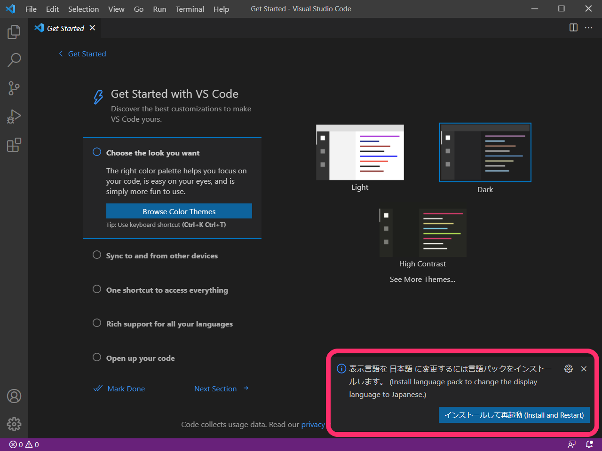
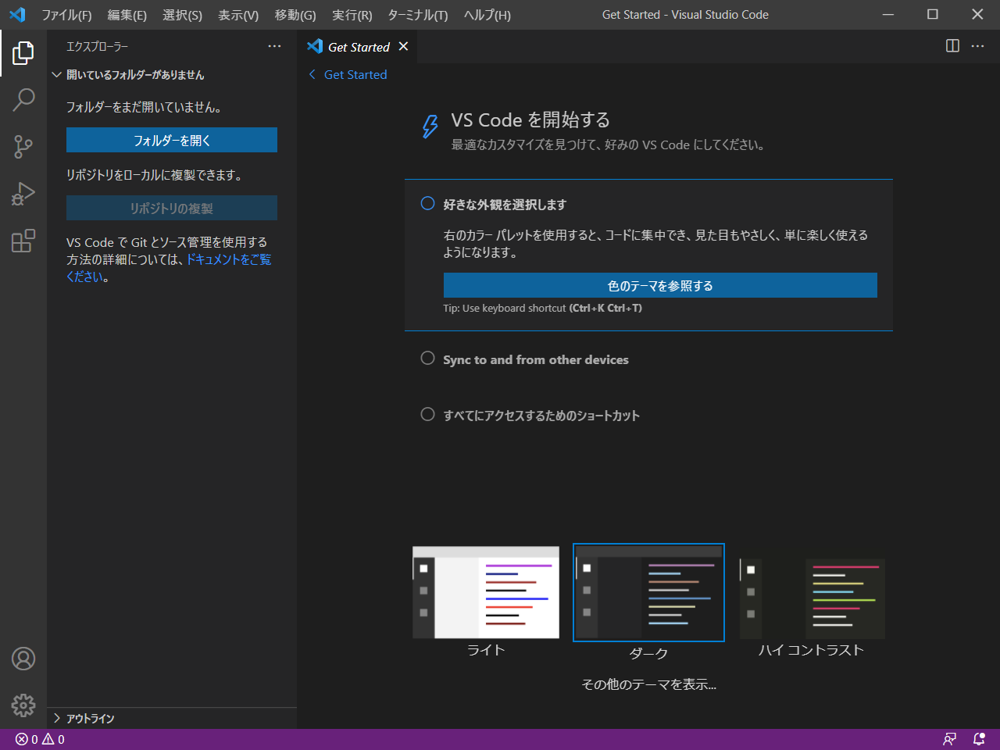

# VS Code のインストール

ここではソースコードエディタ、 Visual Studio Code （以下、VS Code）のインストール方法を解説します。

Windows、macOS でそれぞれ手順が違うので、分けて説明をします。
また、インストールしただけではメニューがすべて英語となっているため、日本語化も行います。

## Windows

Windows では公式サイトからインストーラーを入手し、そのインストーラーを使ってインストールを行います。

### 1. VS Code のインストーラーの入手

次の VS Code 公式ページを開きます。

[Visual Studio Code - Code Editing. Redefined](https://code.visualstudio.com/)

「Download for Windows」というボタンをクリックするとインストーラーのダウンロードが始まります。

_VS Code 公式サイト_

ダウンロードが完了したら、インストーラーを保存できたことを確認しましょう。

_ダウンロードフォルダにあるVSCodeUserSetup-x64-X.XX.X.exe_

確認が出来たら次のステップに進みましょう。

### 2. VS Code のインストール

先ほどダウンロードしたインストーラーを起動して VS Code のインストールを行います。
「VSCodeUserSetup-x64-X.XX.X.exe」というファイルがあることを確認し、ダブルクリックで起動します。[^1]

[^1]: X.XX.X はVS Codeのバージョンで、2021-10-10時点では 1.61.0 です。

起動すると最初は次のウィンドウが現れます。VS Code を利用する上での使用承諾契約書への同意を求められるので、内容を確認し同意すると次に進めます。

_使用承諾契約書への同意_

使用承諾契約書へ同意すると、次はインストール先を求められます。特段理由がなければ最初から指定されている内容で問題ありません。

_インストール先の指定_

インストール先を決めると、今度はスタートメニューフォルダを指定するように求められます。こちらも特段理由がなければそのまま進めて問題ありません。

次は「追加タスクの選択」というメニューが現れます。こちらもそのままの状態ですすめて問題のないものですが、必要なものがあればチェックを入れるのもよいでしょう。

また、「PATHへの追加（再起動後に使用可能）」にチェックを入れておくと、PowerShellなどのCLI操作の際に `code` コマンドの実行で VS Code の利用ができるようになります。

_追加タスクの選択_

ここまで進むと、インストール前の最終確認の画面が現れます。
内容を確認し、問題がないなら「インストール」をクリックしましょう。

_インストール準備完了_

「インストール」をクリックすると、次のような画面に変わります。
インストールが完了すると自動で次の画面に進むので、しばらく待ちましょう。

_インストール状況_

インストールが完了すると次のような画面になります。
「Visual Studio Code を実行する」チェックは必須ではありませんが、すぐに日本語化できるようにチェックをつけたままにしておくと良いでしょう。

_VS Code セットアップウィザードの完了_

## macOS 

macOS は公式サイトから zip ファイルを取得し、Application フォルダに追加をすることでインストールできます。

### 1. VS Code の zip ファイルの入手

次の VS Code 公式ページを開きます。

[Visual Studio Code - Code Editing. Redefined](https://code.visualstudio.com/)

「Download Mac Universal」というボタンをクリックするとzipファイルのダウンロードができます。

_VS Code公式サイト（macOS でアクセス）_

ダウンロードをする際に、次のようなメッセージが現れる場合があります。
"code.visualstudio.com" は VS Code 公式サイトですので「許可」をして、ダウンロードをしましょう。

_ダウンロードの許可を求めるメッセージ_

ダウンロードが完了したら、zip ファイルを保存できたことを確認しましょう。
safari でダウンロードした場合、次の用に zip ファイルは自動で展開された状態でダウンロードされます。

_ダウンロードし、自動展開された VS Code アプリ_

確認が出来たら次のステップに進みましょう。

### 2. VS Code を「アプリケーション」フォルダに移動

zip ファイルから得られたアプリケーション「Visual Studio Code」をダウンロードフォルダから「アプリケーションフォルダ」へ移動します。次のようにドラッグ&ドロップをすれば大丈夫です。

_VS Code をドラッグ&ドロップで移動_

ドラッグ&ドロップをする際、次のように管理者の名前とパスワードを求められますので入力します。

_管理者情報を入力_

アプリケーションフォルダに移動出来たら VS Code のインストールは完了です。

_アプリケーションフォルダにあるVS Code_

#### :warning: アクセスの許可

macOS の場合、VS Codeはインターネットから入手したアプリケーションであるため、開いても問題ないか確認を求めてきます。Appleによるチェックで悪質なソフトウェアが検知されていないのであれば問題ないと判断できるので、メッセージを確認したうえで「開く」をクリックしましょう。

_VS Codeを開いてもいいかの確認メッセージ_

## 日本語化（Windows, macOS 共通）

2021-10-10 時点で VS Code はインストールをしただけではメニュはすべて英語で表示されます。そのままでも使えなくはありませんが、設定などの意味を把握しやすくするためにも日本語化をしておきましょう。

VS Code を起動してしばらくそのままにしておくと、次の画像の様に右下に日本語化のための言語パックのインストールを促すメッセージが表示されます。「インストールして再起動（Install and Restart）」をクリックしましょう。

_言語パックのインストールを促すメッセージが表示される_

言語パックのインストールが完了すると、VS Codeは自動で再起動をし、その際にメニュー等の表示はすべて日本語になります。

_日本語化されたVS Code_
