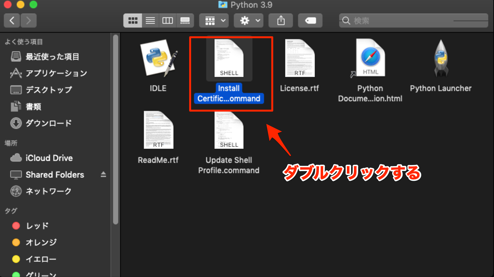
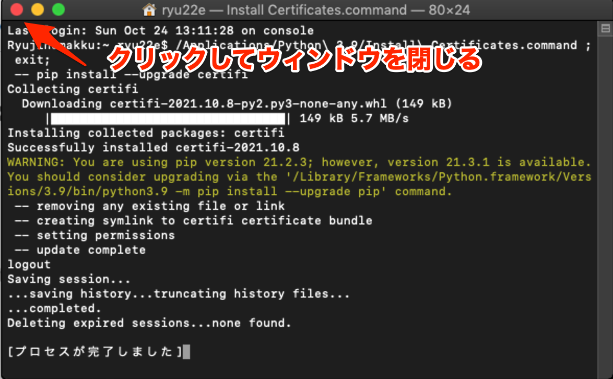
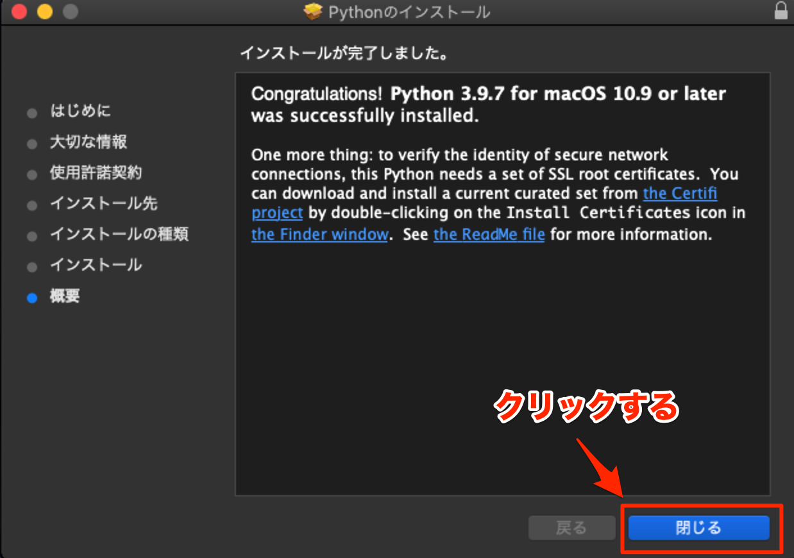

(install-py39-mac)=

# Pythonのインストール(macOS)
ここでは、macOSでのPythonのインストール方法について解説します。

## Pythonのインストーラをダウンロードする
まず最初にPythonのインストーラをダウンロードします。

以下公式サイトをブラウザで開いてください。

[https://www.python.org/downloads/](https://www.python.org/downloads/)

「Download Python 3.9.x」 [^1] というボタンをクリックすると、Pythonインストーラのダウンロードが始まります。

[^1]: `x`には数字が入ります。その時点での最新のバージョン番号によって値は異なります

*Pythonのインストーラのダウンロードページ*

ダウンロードが完了したら、ダウンロード先のフォルダに拡張子pkgのファイルが作成されています。

*ダウンロードされたPythonのインストーラ*

## Pythonをインストールする
ダウンロードしたPythonインストーラをダブルクリックし、以下の画面が表示されたら「続ける」をクリックします。

*ようこそPythonインストーラへ*

「大切な情報」ではこれからインストールされるPythonに関する説明が書かれています。ここは、そのまま「続ける」をクリックしてください。

*大切な情報*

「使用許諾契約」ではPythonの使用許諾契約について書かれています。「続ける」をクリックすると次の画面に進みます。

*使用許諾契約*

使用許諾契約の条件に同意するダイアログが表示されます。同意しなければPythonをインストールすることはできません。「同意する」をクリックすると次の画面に進みます。

*使用許諾契約の条件に同意するダイアログ*

インストールの前に、必要なディスク容量が表示されます。もしこの容量が不足している場合は、インストール前にディスクの空き容量を増やしてください。次に進めるには「インストール」をクリックします。

*必要なディスク容量の確認*

macOSのログインユーザーのパスワードを入力し、「ソフトウェアをインストール」をクリックすると、Pythonのインストールが始まります。

*パスワード入力*

Pythonのインストール中は以下の画面が表示されます。インストールが完了するまでしばらく待ちます。

*Pythonインストール中*

インストール中にFinderが起動し、インストールされたファイルの一覧を確認できるようになります。
この中の「Install Certificates.comman」をダブルクリックします。
この作業はPythonのコードからhttpsのサイトにアクセスする際に使う証明書をインストールするためのものです。

*Install Certificates.commandを実行*

証明書のインストールが完了すると、以下の画面が表示されます。左上の×ボタンをクリックしてウィンドウを閉じます。

*証明書インストール完了*

Finderの後ろに以下の画面が隠れています。「閉じる」をクリックしてインストーラを終了させます。

*Pythonインストール完了*

最後に、インストーラを残すか削除するかを選択します。どちらかを選択するとインストール作業はすべて完了です。

*インストーラを残すか削除するか選択*
