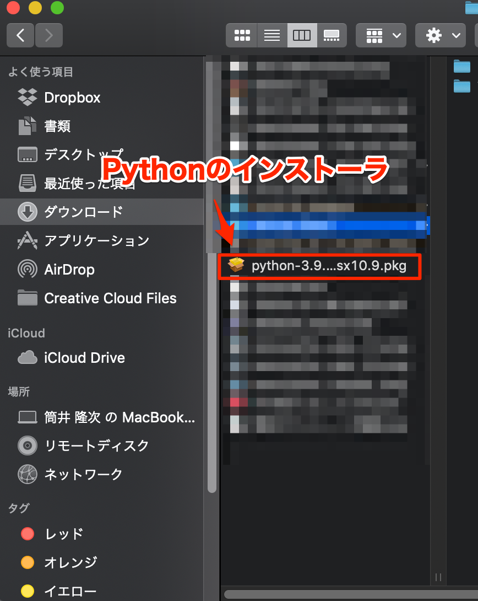

# Pythonのインストール(macOS)
ここでは、macOSでのPythonのインストール方法について解説します。

## Pythonのインストーラーをダウンロードする
まず最初にPythonのインストーラーをダウンロードします。

以下公式サイトをブラウザで開いてください。

[https://www.python.org/downloads/](https://www.python.org/downloads/)

「Download Python 3.9.x」 [^1] というボタンをクリックすると、Pythonインストーラーのダウンロードが始まります。

[^1]: `x`には数字が入ります。その時点での最新のバージョン番号によって値は異なります

*Pythonのインストーラーのダウンロードページ*

ダウンロードが完了したら、ダウンロード先のフォルダに拡張子pkgのファイルが作成されています。

*ダウンロードされたPythonのインストーラー*

## Pythonをインストールする
ダウンロードしたPythonインストーラーをダブルクリックすると、以下の画面が表示されます。

**TODO 画面スクリーンショットを貼る**
