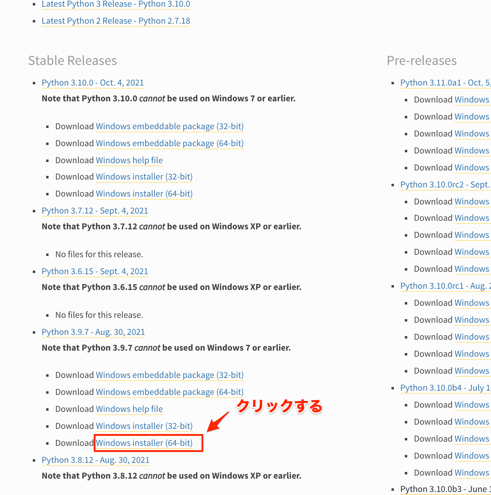
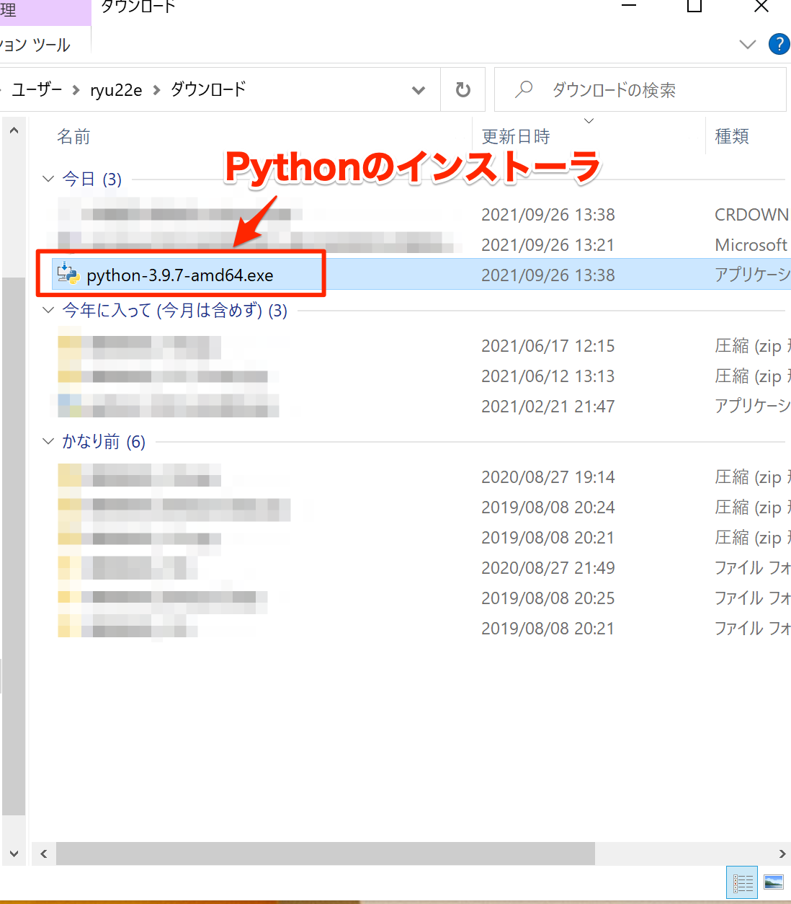
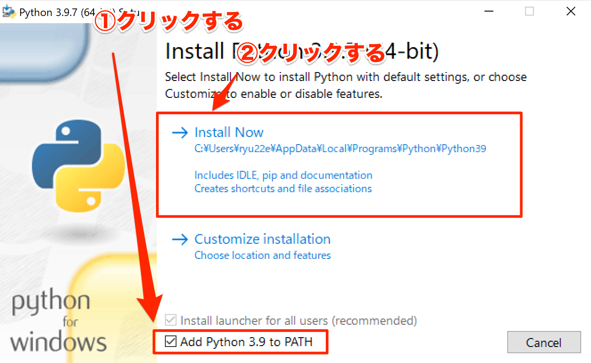
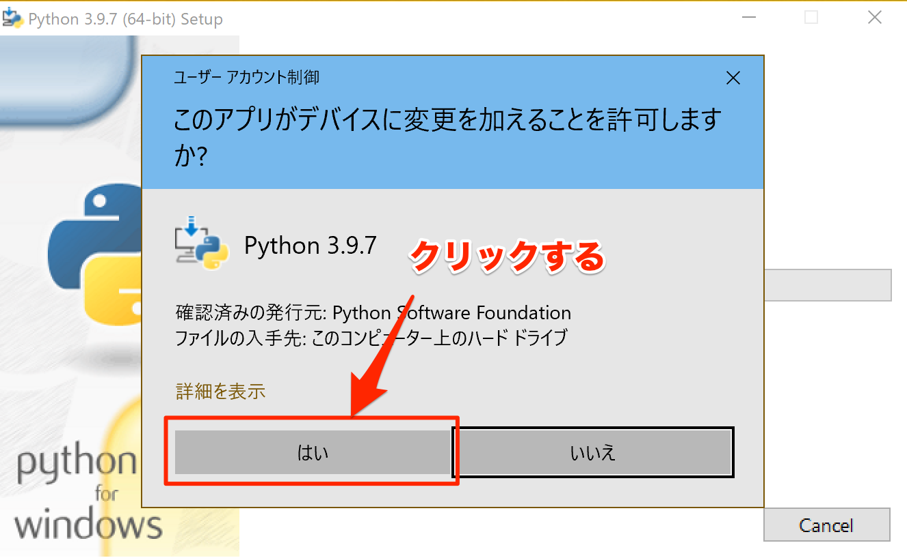
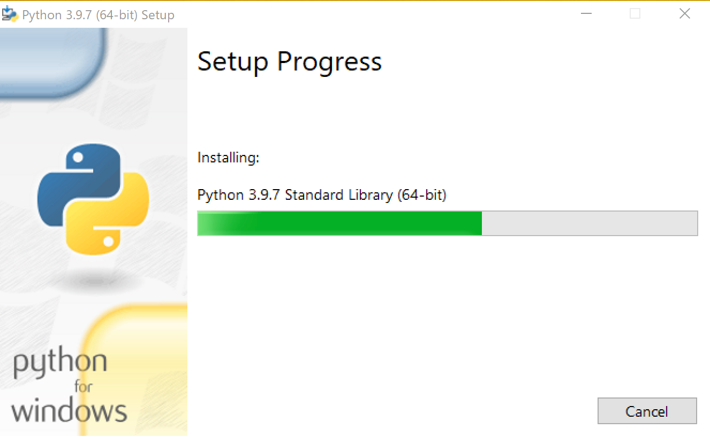
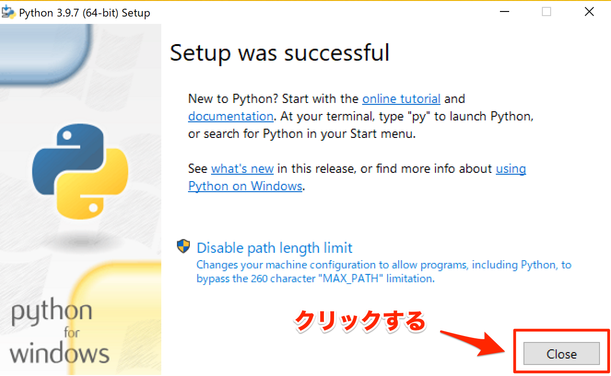

(install-py39-win)=

# Python3.9のインストール(Windows 10)
ここでは、Windows 10でのPythonのインストール方法について解説します。

## Python3.9のインストーラをダウンロードする
まず最初にPython3.9のインストーラをダウンロードします。

以下公式サイトをブラウザで開いてください。

[https://www.python.org/downloads/windows/](https://www.python.org/downloads/windows/)

「Python 3.9.x」 [^1] という表示の下にある「Windows installer (64-bit)」をクリックすると、Pythonインストーラのダウンロードが始まります。

[^1]: `x`には数字が入ります。その時点での最新のバージョン番号によって値は異なります

*Python3.9のインストーラのダウンロードページ*

ダウンロードが完了したら、ダウンロード先のフォルダに拡張子exeのファイルが作成されています。

*ダウンロードされたPython3.9のインストーラ*

## Python3.9をインストールする
ダウンロードしたPythonインストーラをダブルクリックすると、以下の画面が表示されます。
「Add Python 3.9 to PATH」にチェックを入れてから「Install Now」をクリックすると次の画面に進みます。

*Pythonインストーラの最初の画面*

インストールにはWindowsの管理者権限が必要なため、UAC（ユーザーアカウント制御）の確認ダイアログが表示されます。「はい」をクリックして次に進めてください。

*UACのダイアログ*

インストール中は以下の画面が表示されます。

*Pythonインストール中*

インストールが完了すると以下の画面が表示されます。「Close」をクリックしてインストーラを終了させてください。これでPythonのインストールは完了です。

*Pythonインストール完了*
