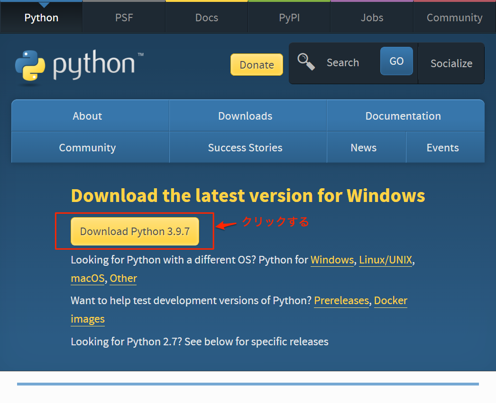
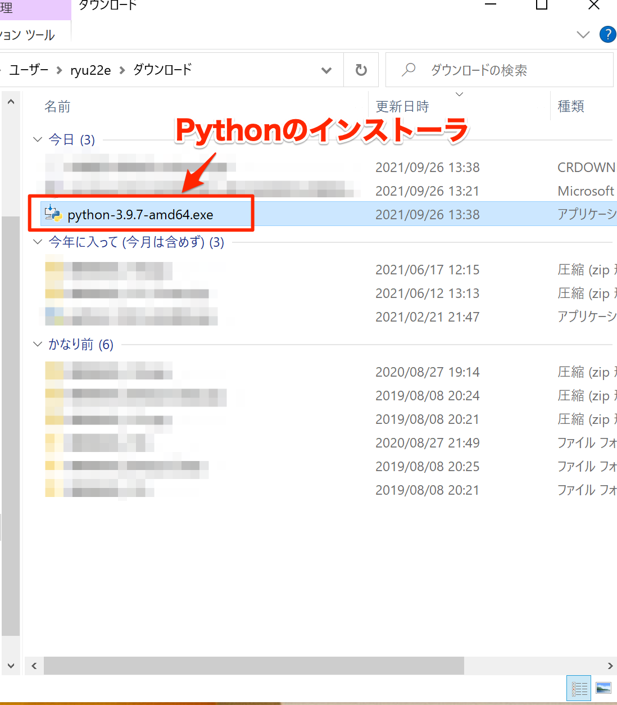
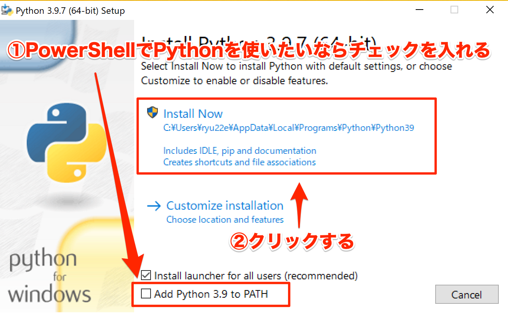
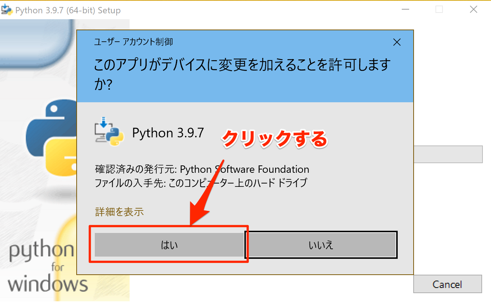
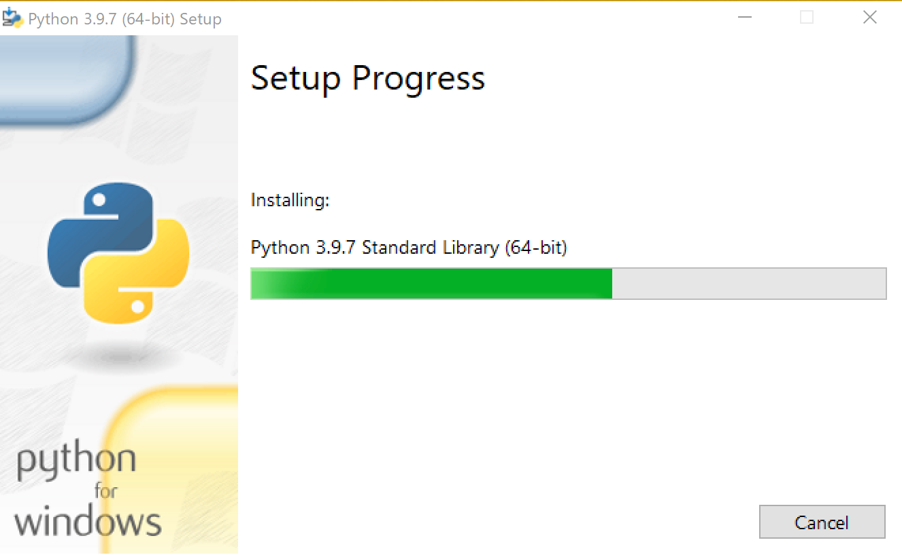
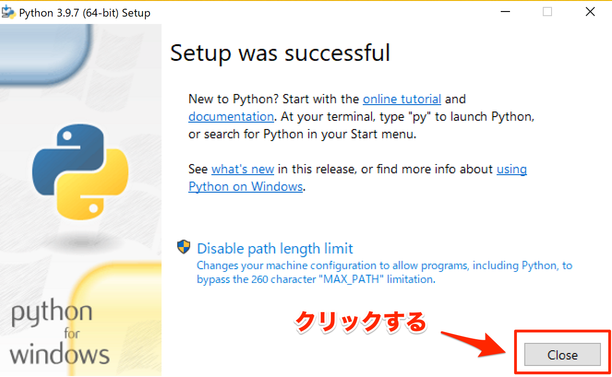

# Pythonのインストール(Windows 10)
ここでは、Windows 10でのPythonのインストール方法について解説します。

## Pythonのインストーラをダウンロードする
まず最初にPythonのインストーラをダウンロードします。

以下公式サイトをブラウザで開いてください。

[https://www.python.org/downloads/](https://www.python.org/downloads/)

「Download Python 3.9.x」 [^1] というボタンをクリックすると、Pythonインストーラのダウンロードが始まります。

[^1]: `x`には数字が入ります。その時点での最新のバージョン番号によって値は異なります

*Pythonのインストーラのダウンロードページ*

ダウンロードが完了したら、ダウンロード先のフォルダに拡張子exeのファイルが作成されています。

*ダウンロードされたPythonのインストーラ*

## Pythonをインストールする
ダウンロードしたPythonインストーラをダブルクリックすると、以下の画面が表示されます。
PowerShellでPythonを使いたい場合は「Add Python 3.9 to PATH」にチェックを入れてください。
「Install Now」をクリックすると次の画面に進みます。

*Pythonインストーラの最初の画面*

インストールにはWindowsの管理者権限が必要なため、UAC（ユーザーアカウント制御）の確認ダイアログが表示されます。「はい」をクリックして次に進めてください。

*UACのダイアログ*

インストール中は以下の画面が表示されます。

*Pythonインストール中*

インストールが完了すると以下の画面が表示されます。「Close」をクリックしてインストーラを終了させてください。これでPythonのインストールは完了です。

*Pythonインストール完了*
