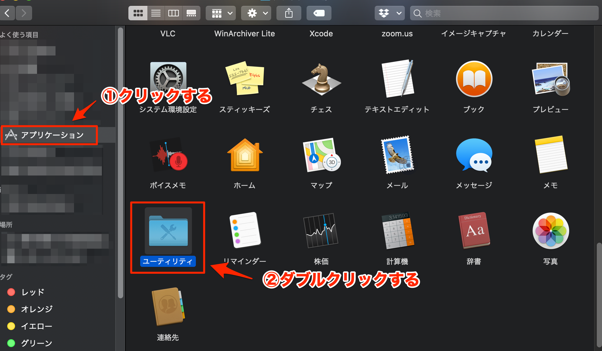

(start-up-and-interpreter)=

# Pythonをコマンドから起動、Pythonの対話モード

ここでは、Pythonをコマンドから起動する方法と、Pythonの対話モードの使い方について解説します。

## Pythonをコマンドから起動

### macOS
Finderを起動し、「アプリケーション」-「ユーティリティ」を開き、「ターミナル」をダブルクリックしてターミナルを起動します。


*Finderで「アプリケーション」-「ユーティリティ」を開く*


*ターミナルを起動*

ターミナル上で以下のコマンドを入力すると、インストールされたPythonのバージョンを確認できます。

```console
$ python3.9 -V
Python 3.9.7
```

このとき、`python -V`のようにpythonコマンドの後ろの数字を省略しないでください。
macOSにはデフォルトでPython 2.7系がインストールされているため、このコマンドではインストールしたものとは別のPythonが起動されてしまいます。

### Windows

## Pythonの対話モード

### macOS

### Windows
