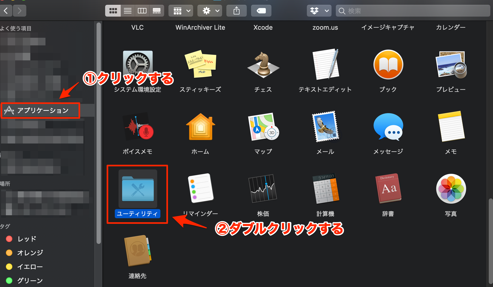
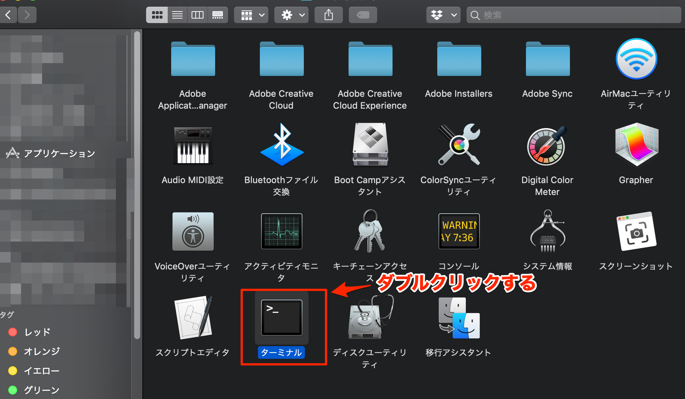
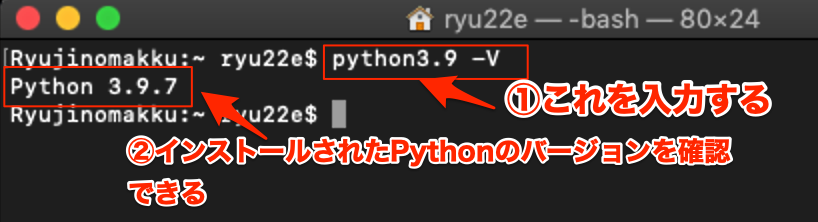
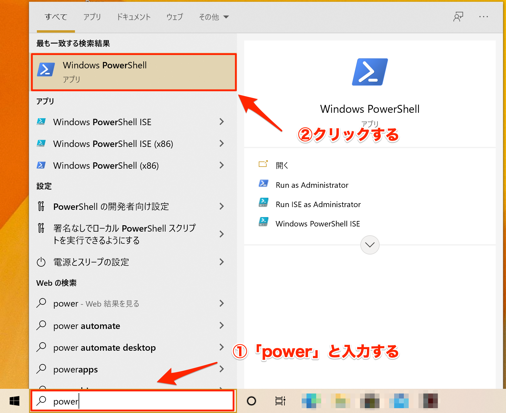
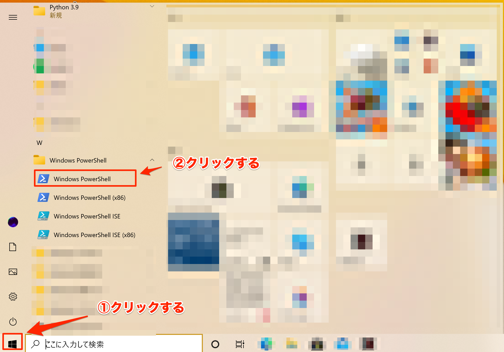
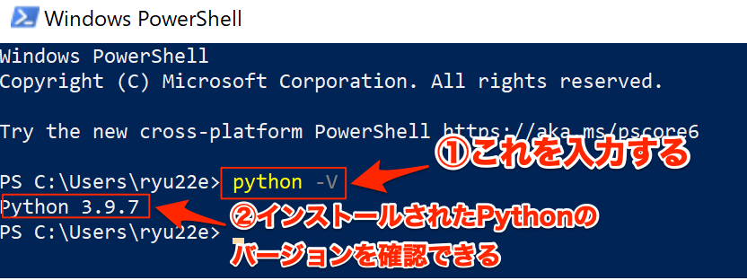

(start-up-and-interpreter)=

# Pythonをコマンドから起動、Pythonの対話モード

ここでは、Pythonをコマンドから起動する方法と、Pythonの対話モードの使い方について解説します。

(run-python-for-mac)=
## Pythonをコマンドから起動

### macOS
Finderを起動し、「アプリケーション」-「ユーティリティ」を開き、「ターミナル」をダブルクリックしてターミナルを起動します。


*Finderで「アプリケーション」-「ユーティリティ」を開く*


*ターミナルを起動*

ターミナル上で`$`より右に`python{バージョン番号} -V`というコマンドを入力すると、インストールされたPythonのバージョンを確認できます。
たとえば、Python 3.9がインストールされている場合は`python3.9 -V`と入力します。


*インストールされたPythonのバージョンを確認*

このとき、`python -V`のようにpythonコマンドの後ろの数字を省略しないでください。
macOSにはデフォルトでPython 2.7系がインストールされているため、このコマンドではインストールしたものとは別のPythonが起動されてしまいます。

### Windows
まず、Windows PowerShellを起動します。画面左下の検索ボックスを使うと素早く起動できます。


*検索ボックスからWindows PowerShellを起動*

検索ボックスを使わない場合は画面左下のスタートボタンをクリックしてからWindows PowerShellのアイコンをクリックしてください。Windows PowerShellのアイコンは、名前が「W」で始まるアプリケーションのフォルダの中にあります。


*スタートボタンからWindows PowerShellを起動*

ターミナル上で`>`より右に`python -V`というコマンドを入力すると、インストールされたPythonのバージョンを確認できます。


*インストールされたPythonのバージョンを確認*

## Pythonの対話モード

{ref}`run-python-for-mac`と同様の方法でターミナルを起動し、以下のコマンドを入力します。

```console
$ python3.9
```

上記コマンドを実行するとPythonの対話モードが起動し、画面が以下の状態になります。

```python
Python 3.9.7 (default, Sep  3 2021, 12:36:14)
[Clang 11.0.0 (clang-1100.0.33.17)] on darwin
Type "help", "copyright", "credits" or "license" for more information.
>>>
```

`>>>`より右にPythonのコードを入力することができます。

```python
>>> print("Hello World!")  # 「Hello World!」を出力
Hello World!
>>> a = 1 + 2 + 3  # 足し算の結果を変数に代入
>>> print(a)  # 変数の内容を出力
6
```

コードが複数行の場合は改行するたびに先頭に`...`が出力されます。
`...`に何も入力しない状態で改行すると、それまでに入力したコードが実行されます。

```python
>>> for i in range(5):  # 0から4までを出力
...     print(i)
...
0
1
2
3
4
```

対話モードは以下のいずれかの方法で終了させることができます。

* `quit()`関数を実行
* `Ctrl + D`を入力（macOSのみ）
* `Ctrl + Z`を入力してからEnterキーを入力（Windowsのみ）
